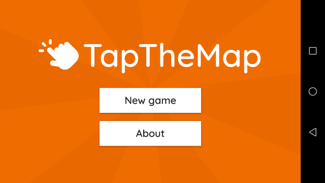
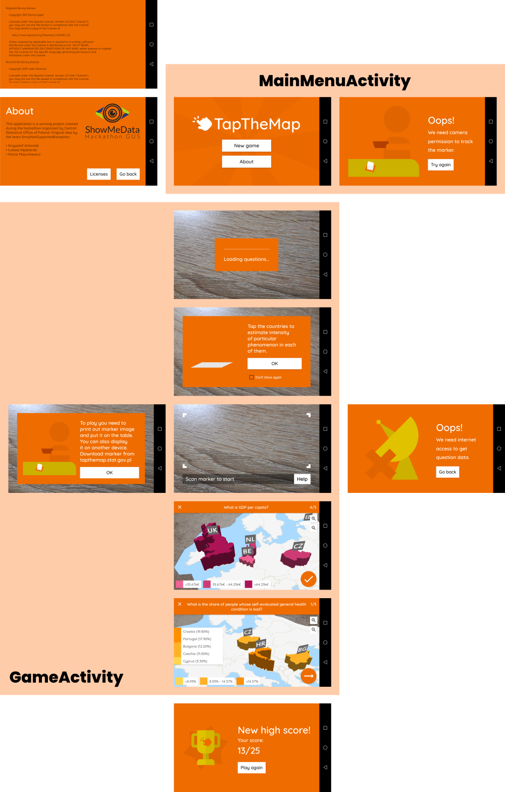

# Tap The Map

  

# Installation
TapTheMap is available in Google Play: https://play.google.com/store/apps/details?id=pl.gov.stat.tapthemap

It can be install directly from APK file (app-release.apk) as well - please follow the instructions: https://www.wikihow.tech/Install-APK-Files-on-Android

# Marker to trigger augmented reality map
To play the game a special marker is required. It should be downloaded and printed form this repository (tap-the-map/tree/master/app/src/main/assets) or from application website: https://hackathon.stat.gov.pl/aplikacje/tap-the-map. The marker is available in two versions: colour or black-and-white.

# Architecture overview 
TapTheMap is a native Android app written in Java. As usual, project is build for gradle, preferably for use with Android Studio. The application itself is contained in `app` subproject, with a default run configuration `app` targeted at devices with API level 24+. App uses Java 8, the newest supported by Android SDK at the time of development (April 2018).

## Desing decisions

### 3D rendering
Europe map rendering is done trough a 3rd party library called Rajawali. The renderer is completely independent from the AR library. By design, there should be no references to `ar` package from `scene`. `MapRenderer` can have a `RenderingDelegate` bound to itself, to handle events important for AR libraries, like `GLSurfaceView` being attached to screen. The intent of this division was to:

1. Enable gameplay for version not using augmented reality at all;
1. To make it simpler to switch to some other library later, for example to ARCore when the device coverage gets bigger

### Data transfer
Internet connection is necessary to use the application. The first thing is, EasyAR requires an application to register itself every time a tracking engine starts. The application does not work otherwise. Second this is, the datasets by Eurostat change relatively often (~every few months). By downloading the data every time, we greatly imcreasy application liveability. Since there is no advanced data analysis, the single request is done in an [`AsyncTask`](https://developer.android.com/reference/android/os/AsyncTask) initiated in `LoadingFragment`.

### Questions handling
Questions are the basis of the gameplay. These are based on data that changes relatively frequently, what leads to a few observations:

1. We expect the question set to evolve and possibly be expanded in the future;
2. Regarding the initial game project, there's a chance question list will be curated online and sent to the devices at application runtime.

That's why all questions are kept in a single JSON file, so it can later be easily integrated in an online workflow. This is also means the question text translations are stored along the data.

### Country identifiers
We use country identifiers in multiple places of the app. `Country` is an identifier class from which you can obtain both ISO alpha 2 codes (e.g. `GR` for Greece) and codes given by European Union (e.g. `EL` for Greece). European country codes, received from Eurostat API, are [here](http://ec.europa.eu/eurostat/statistics-explained/index.php/Glossary:Country_codes). `Country` class should be used wherever possible for consistent ID handling. Names of all assets (OBJ files, textures etc.) use EU names.

## Application flow
Main application flow is divided into Activities, and Fragments in case of `GameActivity`.

  

## Android Studio project

### Compilation
Open project in Android Studio 3.1.0 or higher. Compile `app` configuration.

### Project contents by package
* The main package: activities and general utility classes, e.g. for work with `SharedPreferences`.
* `ar`: support for AR and classes needed to connect with 3D renderer
* `communication`: handles downloading data from public Eurostat databases
* `game_ui`: `Fragment`s used to implement `GameActivity`
* `gameplay`: Encapsulates game logic
* `scene`: 3D renderers, classes representing 3D objects

### Used libraries
All libraries are added as gradle dependencies in `app/build.gradle`

* [Butterknife 8.8.1](http://jakewharton.github.io/butterknife/)
* [Rajawali 1.1.970](https://github.com/Rajawali/Rajawali)
* [EasyAR](https://easyar.com/)
* [Triava 1.0.5](https://github.com/trivago/triava)
* [GSON 2.8.4](https://github.com/google/gson)

## Misc

### Game settings
All game settings are hardcoded in `.gameplay.Gameplay.Settings`. In future, these can be moved to a separate file or download from somewhere.

### AR support
Application uses EasyAR to handle augmented reality. All marker images are defined in `assets/targets.json`, images are held in the same folder.

### Adding questions step by step
1. Locate the file `assets/questions.json`. Standard json file. It contains all necessary data to download questions from Eurostat API and display them properly in application.
2. In the file one can find a list of dictionaries. Each dictionary represents one question. Consists of following keys:
 - `query` - query for Eurostat API (query that one can acquire from Eurostat API Query Builder, but you **should not** add countries and precision in the query, the application will set the propper values by itself)
 - `multiplier` - multiplier of the prefix of the unit (e.g. `1000000`)
 - `base_unit` - the base unit used in the question (e.g. `€`) (in this case `multiplier` and `base_unit` represent the question, where the unit is milions of euros)
 - `category` - category of the question based on Eurostat, possible categories are listed in pl.gov.stat.tapthemap.gameplay.QuestionCategory enum
 - `localized_text` - JSON map, consists of country codes as keys and translations of the question string that is displayed to the user
3. In order to add a question one need to create a new dictionary and place it in the main list.

### Adding marker step by step

1. In order to add a new marker to the application, one need to add a `*.png` file to the assets directory.
2. One also need to add a new entry in `assets/targets.json` file. In the main dictionary, for the key `images` the value is the list of the dictionaries containing entry for each marker that application is aware of. Each of dictionaries consists of following keys:
 - `image` - name of the file
 - `uid` - id of the marker (might be any arbitrary id)
 - `name` - name of the marker (might be any arbitrary name)
 - `size` - says how big the marker size is in the virtual world (`[1, 1]` by default, we use `[2.5, 2.5]`)
 
 
##  Open source license

Copyright &copy; 2018 Główny Urząd Statystyczny

Contents of this repository is licensed under GNU General Public License, version 3.0 (GPL-3.0).
